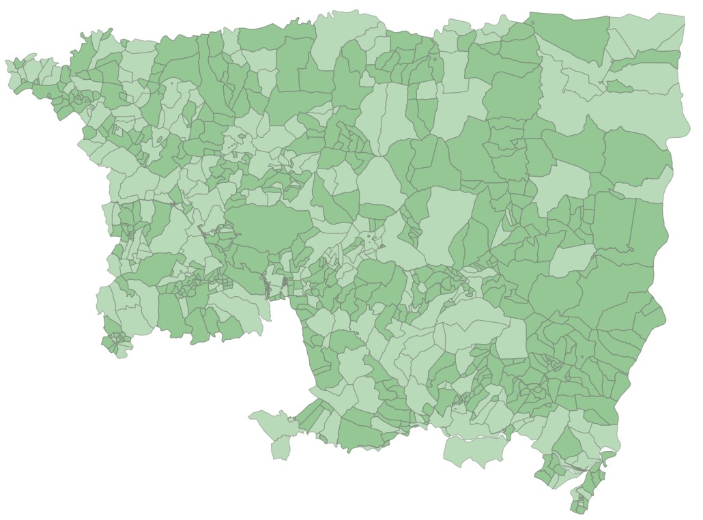
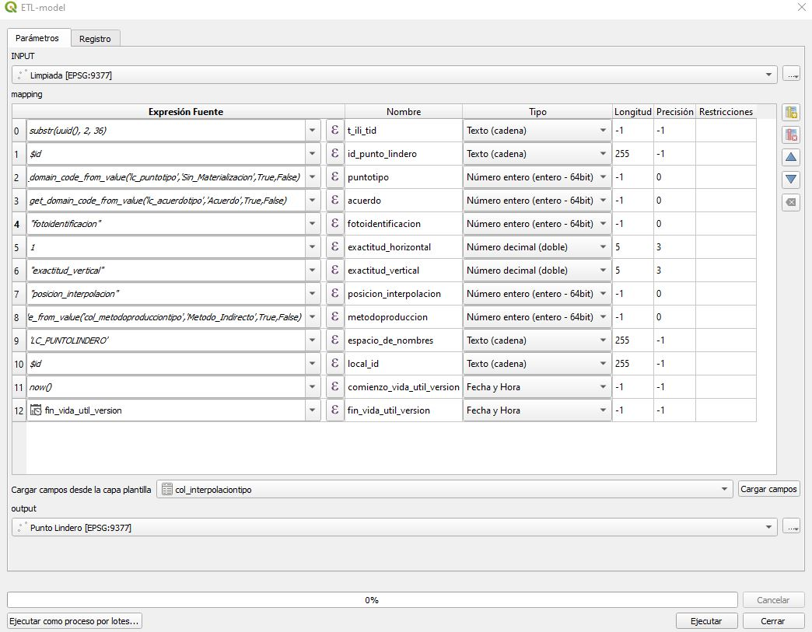
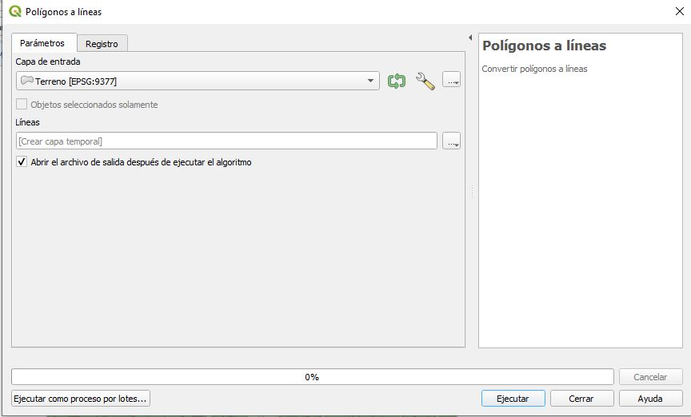
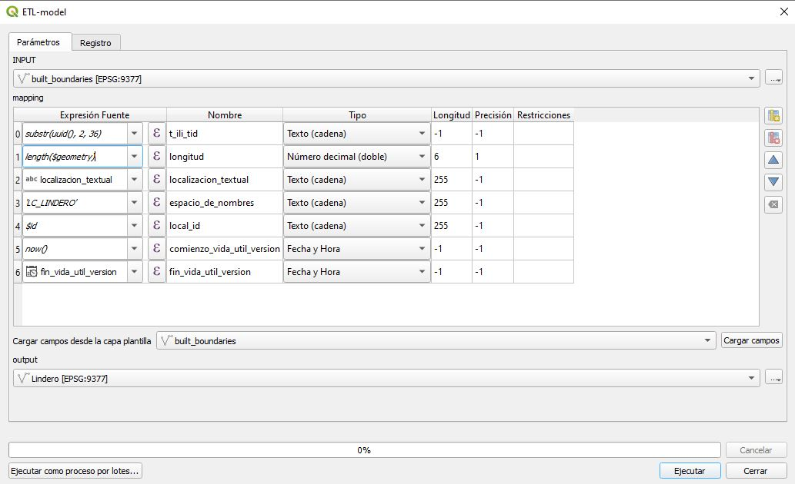

#  ¿Cómo calcular los linderos y puntos linderos a partir de los polígonos de terrenos?

## Objetivo

Enseñar al estudiante a diligenciar el paquete de topografia y representación a partir de la capa de terrenos existentes.

## Datos

XTF con las UIT (Unidad de intervención Territorial):
	- UIT_1
	- UIT_2
	- UIT_3

datos --> datos/LADM_UIT.zip

## Ejercicio

### Insumo General 	


### Borrado de datos

Dado que el archivo XTF el cual se emplea como fuente de información empleada en la base de datos, viene con una serie de datos en algunas tablas que se van a crear en el ejercicio, se es necesario borrar todos los registros que estas posean, para esto deberá ejecutar la siguiente sentencia en SQL.

```SQL
delete from col_masccl where true=true;
delete from col_menosccl  where true=true;
delete from col_puntoccl where true=true;
delete from lc_lindero where true=true;
delete from lc_puntolindero where true=true;
```

### Generación de punto lindero

Para la generación de la clase punto de lindero a partir de un insumo de geometría polígono, el cual para el ejercicio corresponde a la capa de terrenos, se deberá seguir el siguiente proceso metodológico:

- Al ya tener cargado la capa de terrenos en QGIS se deberá dirigir a la barra superior de herramientas, en el ítem denominado **Procesos** se desplegará una lista de opciones y deberá dar clic izquierdo sobre caja de herramientas de procesos.
	
	

- Posterior a esto a mano derecha emergerá una ventana, en la cual se deberá buscar la herramienta **Extract Vertices** o **Extraer vértices** de la geometría vectorial en la barra de búsqueda.

	

- Después de seleccionar la herramienta **Extraer vértices** emergerá un cuadro de diálogo, en él se deberá seleccionar en el ítem de *capa de entrada* el insumo *terreno*, finalmente deberá dar clic izquierdo en el botón **Ejecutar**.
	

- Posterior a realizar la ejecución de la herramienta, emergerá la capa temporal de geometría tipo punto, tal como se puede observar.

	

- Al analizar el insumo generado se encuentran un problema topológico, el cual es la presencia de puntos con superposición espacial, para solucionar esta eventualidad de manera masiva, se deberá dirigir a la caja de herramientas y seleccionar la herramienta **Borrar geometrías duplicadas**.

	

- Después de seleccionar la herramienta **Borrar geometrías duplicadas** emergerá un cuadro de diálogo, en él se deberá seleccionar en el ítem de *capa de entrada* el insumo *Vertíces*, finalmente deberá dar clic izquierdo en el botón **Ejecutar**.

	

- Posterior emergerá una capa temporal denominada *Limpiada*, este nuevo insumo garantizará la solución del problema topológico presentado pasos anteriores, tal como se puede observar una localización pasa de 6 a 1 registro.
	

- Después de tener el insumo el cual se va a emplear para la generación de la clase punto lindero, se dirigirán al ítem de la barra de herramientas denominada **LADM-COL**, ahí deberá navegar por la siguiente ruta:
	- Captura y estructuración de datos.
	- Levantamiento catastral
	- Topografía y representación.
	- Crear punto.

	

- Prosiguiendo con la creación de la clase punto lindero, emergerá un cuadro de diálogo para creación del punto, en esta primera pestaña deberá seleccionar la opción de **Punto Lindero** y dar clic izquierdo en el botón siguiente.

	

- En el siguiente ítem del cuadro de diálogo encontrará dos opciones de creación del punto lindero, para esto se seleccionará la opción **Desde otra capa de QGIS** en el cual se buscará el insumo que se quiere importar, finalmente dar clic en el botón *Importar* .

	 

- Posterior emergerá un cuadro de diálogo en el cual estarán cada uno de los atributos definidos para la clase punto lindero, en el modelo  de levantamiento catastral en la versión 1.2, en él se deberá realizar el mapeo del insumo generado.

	

- En este proceso será obligatorio el diligenciamiento de los atributos obligatorios definidos para la clase **LC_PuntoLindero** el cual hereda los atributos de la clase  **COL_Punto**, los cuales son:
  
	- ID_Punto_Lindero
	- PuntoTipo
	- Acuerdo
	- Exactitud_Horizontal

	

- La función **get_domain_code_from_value**, emplea el dominio y el valor que se le quiera asignar, ejemplo de esto para el atributo **PuntoTipo** definido en el dominio **LC_PuntoTipo**, al cual se le asigna el valor *Sin_Materializacion*, finalmente deberá dar clic en el botón aceptar. 

	

- Para los atributos obligatorios se empleará las siguientes expresiones:

	- PuntoTipo ***get_domain_code_from_value('col_puntotipo','Catastro.Sin_Materializacion',True,False)*** 
	- MetodoProduccion ***get_domain_code_from_value('col_metodoproducciontipo','Metodo_Indirecto',True,False)***
	- ID_Punto_Lindero ***$id***
	- Acuerdo ***get_domain_code_from_value('lc_acuerdotipo','Acuerdo',True,False)***
	- Exactitud_Horizontal ***1***

	
	
	Se dará clic sobre la opción **Ejecutar**, lo que permitirá una finalización exitosa de la creación del punto lindero. 

	

- Dar clic sobre el botón ***Cerrar*** para visualizar el resultado final

	
 
 ### Generación de linderos

Posterior a crear la clase de punto lindero, se procede con la creación de los linderos asociados a dichos puntos, para este proceso se empleará el insumo general anteriormente presentado, para esto se plantea la siguiente ruta metodológica:

- En la caja de herramientas de procesos, deberá buscar la herramienta **Polígonos a líneas** o **Polygons to lines**, luego de esto dar clic izquierdo sobre la funcionalidad.

	

- Posterior a esto emergerá un cuadro de diálogo asociado a la herramienta, en el campo de *capa de entrada* seleccionaremos el insumo *Terreno*, finalmente deberá dar clic izquierdo en el botón **Ejecutar**.


	

-	Tiempo después de ejecutar la herramienta, emergerá la capa temporal de geometría tipo línea, tal como se puede observar.
	

- Posterior a revisar el insumo temporal generado, se encuentran varios errores, los cuales son:
	- Presencia de superposición espacial entre diferentes arcos de líneas.
	- El no estar estructura bajo el modelo de cambio de colindancia.

- Para solventar las problemáticas anteriormente mencionadas, se empleará una herramienta diseñada a partir del **The graphical modeler** o **Modelador Grafico** de QGIS, para esto deberá seguir la siguiente serie de pasos:
	- En la barra de herramientas en el ítem de *Procesos* seleccionar la opción **Modelador Grafico**.
		
	-  Después de esto emergerá una nueva ventana, en la cual el usuario podrá desde diseñar o abrir un modelo el cual será una secuencia de procesos empleados para dar respuesta a una necesidad.
		

	- Deberá dirigirse a la barra herramientas y en el ítem de **Model**, seleccionar la opción de *Open Model*, luego de esto emergerá un cuadro de diálogo del gestor de archivos, en él deberán dirigir a la ubicación donde se encuentra el directorio del proyecto, en donde  encontrara una carpeta que se denomina *Modelo*, finalmente seleccionar el archivo ***model_build_boundaries.model3*** y dar clic izquierdo en el boton abrir. 

		
		
	- Luego de importar el archivo del modelo, emergerá en la ventana del modelador gráfico, la secuencia de cada uno de los procesos implementados.
	
		
	
	- Finalmente, para poder implementar el modelo en el proyecto, deberá dirigirse a la barra superior y en el cuarto símbolo de izquierda derecha de color verde y dar clic izquierdo, luego de esto emergerá un mensaje donde indicara que el modelo ha sido guardado dentro del proyecto actual.


		

- En la caja de herramientas de procesos deberá buscar la herramienta **Build_Boundaries**, la cual se encontrará en el grupo de modelos del proyecto.

	

- Al seleccionar la herramienta importada, emergerá un cuadro de diálogo en el cual el usuario deberá indicar en el parámetro de capa entrada el archivo *Lineas*, posterior al dar clic en el botón ejecutar.

	


- Al revisar los resultados obtenidos por el algoritmo empleado, se depura un total de, 21127 registros duplicados, además de a estructurar cada segmento de línea, con el formato de cambio de colindancia.
	

- Después de tener el insumo el cual se va a emplear para la generación de la clase lindero, se dirigirán al ítem de la barra de herramientas denominada **LADM-COL**, ahí deberá navegar por la siguiente ruta:
	- Captura y estructuración de datos.
	- Levantamiento catastral
	- Topografía y representación.
	- Crear lindero.

		

-  Luego de esto emergerá un cuadro de diálogo, donde se indicará la forma de creación del lindero, para esto se deberá seleccionar la opción **Desde otra capa de QGIS**, como insumo de fuente la capa ***built_boundaries*** y finalmente importar.

	
	
- Después de esto en una ventana se realizará el mapeo de valores del insumo que se va a usar, con respecto a la estructura de la clase *Lindero*, siendo el único de carácter obligatorio el atributo *Longitud*, para su estimación  se empleara la expresión ***length($geometry)***, finalmente dar clic izquierdo en el botón ejecutar.

	

- Finalmente, se ha creado un total de 6219 linderos, cada uno con su estructura alfanumérica y geométrica debidamente implementada.

	

## Creación de las relaciones
### PuntoCCL
La tabla Col_puntoCCL es aquella tabla de paso que permite relacionar la clase lindero con respecto a la clase punto (lindero, levantamiento y control),  para esto se debe realizar el siguiente proceso.


- En la sección de herramientas del asistente LADM, deberá seleccionar el quinto símbolo de izquierda a derecha, en él emergerá el mensaje **Llenar PuntosCCl**.

	

- Emergerá un cuadro de diálogo en el cual se pregunta si se desea diligenciar la tabla con los 2811 linderos creados, se dará clic izquierdo en el botón **Sí**.

	

- Finalmente, luego realizar el debido procesamiento, emergerá un mensaje en donde se indicará que se ha creado de manera exitosa.

	

### Col_MasCCL y Col_MenosCCL

La tabla Col_MasCCL y Col_MenosCCL son aquellas tablas de paso que permite relacionar la clase lindero con respecto a la clase terreno,  para esto se debe realizar el siguiente proceso.


- En la sección de herramientas del asistente LADM, deberá seleccionar el sexto símbolo de izquierda a derecha, en el emergerá el mensaje **Llenar más CCl y menos**.

	

- Emergerá un cuadro de diálogo en el cual se pregunta si se desea diligenciar la tabla con los 1240 terrenos creados, se dará clic izquierdo en el botón **Sí**.

	

- Finalmente, luego realizar el debido procesamiento, emergerá un mensaje en donde se indicará que se ha creado de manera exitosa.

	
