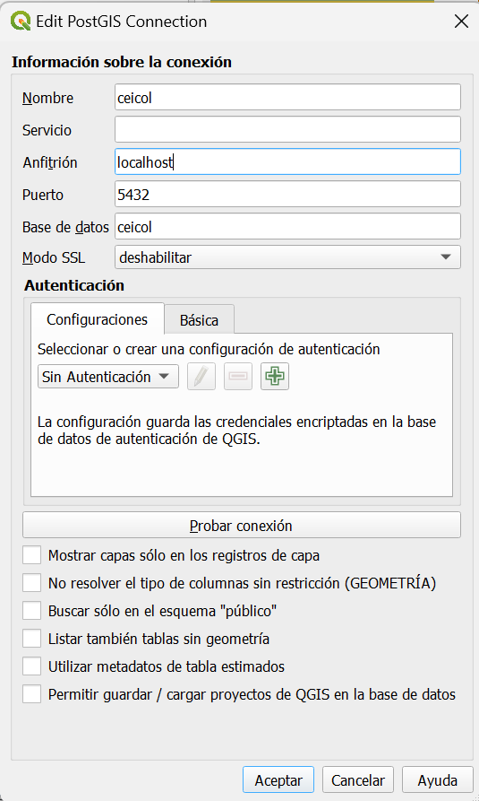

#  ¿Cómo realizar consultas personalizadas del modelo de levantamiento catastral y visualizarlas en QGIS?

## Objetivo

Enseñar al estudiante a realizar consultas dinámicas que integren diferentes tablas del modelo de Levantamiento Catastral 1.2 y visualizar su resultado en QGIS.

## Datos

XTF con las UIT (Unidad de intervención Territorial):

- 1
- 2
- 3

datos --> datos/LADM_UIT.zip

## Ejercicio

Para la consulta a realizar se utilizará lo señalado en el siguiente modelo:


En el modelo entidad relación se ve de la siguiente forma:


## Por creación de vistas

Desde PostgreSQL es posible crear vistas las cuales pueden ser cargadas en QGIS de acuerdo a las necesidades de cada consulta.

Para crear la consulta puede utilizarse el administrador DBeaver o PGAdmin y desplegar la siguiente consulta. Es de aclarar que, para verificar que la consulta se realice correctamente, deben existir datos.

Como ejemplo se usará Dbeaver para la creación de la vista, se ubicará el esquema de la base de datos para crear la vista y se creará la vista usando el SQL Editor de la herramienta como se observa a continuación:


Luego escribimos la siguiente consulta:

```sql
create or replace view predio_interesado as
Select distinct row_number() OVER () AS id
, p.numero_predial as "Numero predial"
, p.id_operacion as "ID Operacion"
, ld2.dispname  as "Tipo_derecho"
, li.documento_identidad as "Documento de identidad"
, li.nombre as "Nombre Interesado"
, la.nombre as "Nombre Agrupación"
, ter.geometria 
FROM ladm.lc_predio p
left join ladm.col_uebaunit cue on p.t_id = cue.baunit
left join ladm.lc_terreno ter on cue.ue_lc_terreno = ter.t_id
left join ladm.lc_derecho ld on p.t_id = ld.unidad
join ladm.lc_derechotipo ld2 on ld.tipo = ld2.t_id 
left join ladm.lc_interesado li on ld.interesado_lc_interesado = li.t_id 
left join ladm.lc_agrupacioninteresados la on ld.interesado_lc_agrupacioninteresados = la.t_id;
```

La consulta puede personalizarse tanto como se desee, una vez escrita la consulta ejecutamos la consulta utilizando la combinación de teclas CTRL+Enter, de esta manera se creará la vista correspondiente.

Ahora desde QGIS es posible cargar la vista accediendo al menú Capa -> Añadir capa -> Añdir capas PostGIS 


Se debe realizar la configuración de la conexión correspondiente a PostGIS



Y una vez se configura la conexión es posible cargar la vista correspondiente:


De esta manera es posible usar la herramienta de identificación de QGIS para hacer las consultas correspondientes, así como la tabla de atributos:


De esta manera es posible hacer Consultas personalizadas.

## Por Joins

Para realizar consultas por Joins se deben cargar inicialmente las capas que estarán involucradas en la consulta, esto se puede hacer desde la función "Cargar Capas" del Asistente LADM-COL:


Desde la capa Terreno se accede a Propiedades y posteriormente se accede al botón Uniones:


Se debe dar click en el botón + y posteriormente se debe empezar a recorrer el modelo a través de las tablas requeridas dentro de la consulta (Empezando por col_uebaunit):


Y así sucesivamente con las demás tablas:

#### LC_Predio


#### LC_Derecho


#### LC_Interesado


#### LC_AgrupacionInteresados


De esta manera es posible obtener los datos de la consulta, es de aclarar que estos joins corresponden únicamente al proyecto de QGIS, por ende, este debe guardarse y mantenerse para recuperar la consulta cada que se requiera. Al final al usar la herramienta de identificación o la tabla de atributos se obtiene algo como lo siguiente:


Dentro de la tabla de atributos, es posible quitar algunos campos en la visualización para mejorar el filtro de la consulta que se desea, esto se hace con el botón de organizar columnas 


De esta manera la consulta se verá así:


Es así como pueden obtenerse consultas que pueden ser visualizadas en QGIS