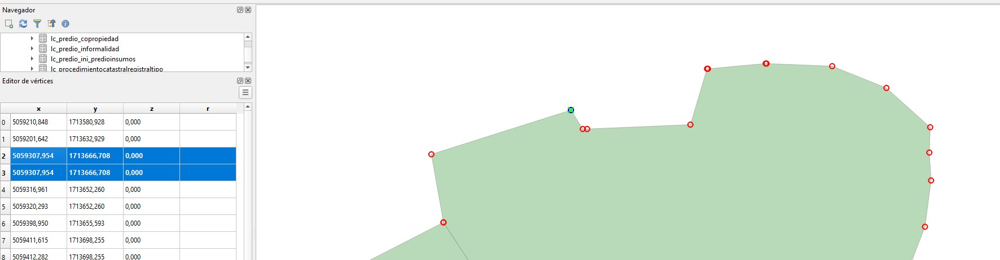
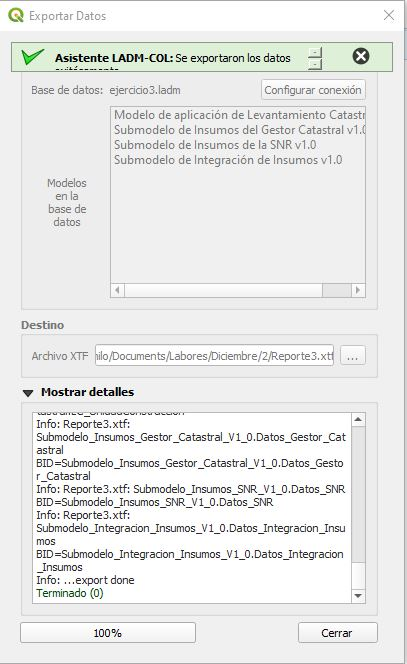

# Validaciones de estructura

Las reglas de estructura tiene como propósito asegurar que los datos recopilados cumplan con la estructura del modelo utilizado. Una forma de validar las reglas de estructura es poder exportar la base de datos a un archivo XTF válido. 

Poder generar un archivo XTF válido no quiere decir que el conjunto de datos es válido, es simplemente un indicativo que nos permite saber que el conjunto de datos es válido.


## Ejercicio

Una de las primeras validaciones que se deben cumplir para asegurar con la calidad de la información catastral recolectada en campo conforme al modelo LADM-COL de Levantamiento Catastral  1.2 es poder generar el archivo XTF, el cual es el formato de intercambio interoperable que valida de forma masiva los datos.

En este ejercicio el estudiante aprenderá a analizar el log de errores que puedan surgir al momento de exportar una base de datos y aprenderá a resolver los errores para generar un archivo XTF valido.

## Datos

En el siguiente enlace podrá encontrar el backup de la base de datos empleada en este ejercicio.

[Datos.](Recursos/datos.backup)

### Introducción

Se cuenta con una base de datos que soporta el modelo de levantamiento catastral versión 1.2.


Al intentar exportar la información al formato XTF con validaciones activadas se genera el siguiente log de errores:


| Caso         | Geometrías con vértices duplicados                           |
| ------------ | ------------------------------------------------------------ |
| **Solución** | Remover vértices duplicados. Se puede utilizar el algoritmo **Remove duplicate vertices** y otros se remueven manualmente |
| **Nota**     |                                                              |

**Ejemplo**:

```sql
Error: line 0: Modelo_Aplicacion_LADMCOL_Lev_Cat_V1_2.Levantamiento_Catastral.LC_Terreno: tid a5c9de49-b7e9-4666-bb36-ffc2c556a139: duplicate coord at (5059307.954, 1713666.708, 0.0)
```
Como se puede observar la presencia de un vértice duplicado en uno de los registros de la clase lc_terreno, en los vértices 2 y 3.




Para la solución emplearemos la funcion ST_RemoveRepeatedPoints, la cual se le  asignara una tolerancia de 0.001, para finalmente remover los vértices repetidos en la capa lc_terreno.

```sql
update lc_terreno te 
set geometria  = public.ST_RemoveRepeatedPoints(te.geometria , 0.001)
where 1=1;
```


| Caso         | Agrupaciones de interesados con un único interesado o sin interesados asociados |
| ------------ | ------------------------------------------------------------ |
| **Solución** | Eliminar de la base de datos las agrupaciones de interesados que tienen asociado un único  o ningún interesado. En el proceso también se depuran las tablas col_miembros. |
| **Nota**     |                                                              |
| **Ejemplo**: |                                                              |

```sql
Error: line 0: Modelo_Aplicacion_LADMCOL_Lev_Cat_V1_2.Levantamiento_Catastral.LC_AgrupacionInteresados: tid d0cfb0a0-451a-4d9c-851c-b9d06180a786: interesado should associate 2 to * target objects (instead of 1)
```
Identificación de agrupación de interesados, las cuales solo tengan un solo interesado relacionado.

```sql
select * from lc_agrupacioninteresados where t_id in 
	(
	select 
		agrupacion 
	from col_miembros cm  group by agrupacion
	having(count(agrupacion))=1
	);
```


| t_id   | t_ili_tid                            | tipo | nombre    | comienzo_vida_util_version | fin_vida_util_version    | espacio_de_nombres | local_id |
| ------ | ------------------------------------ | ---- | --------- | -------------------------- | ------------------------ | ------------------ | -------- |
| 108392 | d30a987e-7cf7-47ba-bd64-3de157bdbefa | 17   | pruebas_1 | 2023-07-25 15:47:13.776    | LC_AGRUPACIONINTERESADOS | 0                  |          |

Para poder realizar la corrección, se debe depurar el registro vinculado en  la tabla **col_miembros**, el registro que vincula al interesado con la agrupación de interesados, para finalmente depurar el registro en la tabla **lc_agrupacioninteresados**.

```postgresql
--Borrado del registro vinculado a la agrupacion en la tabla miembros
delete from col_miembros where t_id  in 
	(
	select 
		cm2.t_id 
	from col_miembros cm2 
	where cm2.agrupacion in 
		(
		select 
			agrupacion 
		from col_miembros cm  group by agrupacion
		having(count(agrupacion))=1
		)
	);
	
--Borrado del registro en la agrupacion de interesados
delete from lc_agrupacioninteresados where t_id in	
	(
	select 
		la.t_id  
	from lc_agrupacioninteresados la 
	left join col_miembros cm  on la.t_id =cm.agrupacion 
	where cm.agrupacion  is null
	);
```

| Caso         | Derechos sin fuentes administrativas asociadas               |
| ------------ | ------------------------------------------------------------ |
| **Solución** | Eliminar los derechos que no tengan vinculada ninguna fuente administrativa. |
| **Nota**     |                                                              |
| **Ejemplo**: |                                                              |

```sql
Error: line 0: Modelo_Aplicacion_LADMCOL_Lev_Cat_V1_2.Levantamiento_Catastral.LC_Derecho: tid a09c9918-2f4a-4f78-87d2-3f551af02087: fuente_administrativa should associate 1 to * target objects (instead of 0)
```
Identificación del derecho que no está relacionado a una fuente administrativa.
```sql
select 
	de.* 
from lc_derecho de 
left join col_rrrfuente cr 
on de.t_id = cr.rrr_lc_derecho 
where cr.rrr_lc_derecho is null; 
```


| t_id   | t_ili_tid                            | tipo | fraccion_derecho | fecha_inicio_tenencia | descripcion | interesado_lc_interesado | interesado_lc_agrupacioninteresados | unidad | comienzo_vida_util_version | fin_vida_util_version | espacio_de_nombres | local_id |
| ------ | ------------------------------------ | ---- | ---------------- | --------------------- | ----------- | ------------------------ | ----------------------------------- | ------ | -------------------------- | --------------------- | ------------------ | -------- |
| 108394 | a09c9918-2f4a-4f78-87d2-3f551af02087 | 609  | 1                |                       |             |                          |                                     |        | 2023-07-25 16:03:57.108    | LC_DERECHO            | 0                  |          |

Depuración de los derechos que no poseen una fuente administrativa relacionada.

```sql
delete from lc_derecho 
where t_id in 
	(
	select 
		de.t_id  
	from lc_derecho de 
	left join col_rrrfuente cr 
	on de.t_id = cr.rrr_lc_derecho 
	where cr.rrr_lc_derecho is null
	);
```
| Caso         | Un predio solo debe tener una asociación en la tabla de datos adicionales de levantamiento catastral |
| ------------ | ------------------------------------------------------------ |
| **Solución** | Se debe eliminar las asociaciones entre lc_predio y lc_datosadicionaleslevantamientocatastral que estén duplicadas. |
| **Nota**     | Se debe seleccionar cuales son los datos adicionales que se deberían eliminar para cada uno de los predios. |

**Ejemplo**:  

```sql
Error: line 0: Modelo_Aplicacion_LADMCOL_Lev_Cat_V1_2.Levantamiento_Catastral.LC_Predio: tid cee5a6cf-5df6-4ff6-ac2e-f54642423a92: lc_datos_adicionales should associate 0 to 1 target objects (instead of 2)
```
Identificación de los predios con más de un registro asociado en la tabla **lc_datosadicionaleslevantamientocatastral**.
```sql
select 
	ld.lc_predio Predio,
	count(ld.lc_predio) Numero_datos
from lc_datosadicionaleslevantamientocatastral ld 
group by ld.lc_predio 
having count (ld.lc_predio) > 1;
```
| Predio | Numero_datos |
| ------ | ------------ |
| 104416 | 2            |

Se borra los últimos registros adicionales creados en la taba **lc_datosadicionaleslevantamientocatastral**, esto con el objetivo de preservar uno de los registros.
```sql
delete  from lc_datosadicionaleslevantamientocatastral ld2 
where ld2.t_id in ( 
	select  ld.t_id from
		(
		select 
			ld.t_id,
			row_number() over (partition by ld.lc_predio) as numerofila
		from lc_datosadicionaleslevantamientocatastral ld ) as ld where ld.numerofila >1
		);
```
| Caso         | Una  características de la unidad de construcción  no debe tener más de una calificación por tipologías asociadas |
| ------------ | ------------------------------------------------------------ |
| **Solución** | Eliminar los registros adicionales de las calificaciones por tipologías. |
| **Nota**     | Se debe indicar cuales son las calificaciones por tipología que se deben eliminar. |

**Ejemplo**:

```sql
Error: line 0: Modelo_Aplicacion_LADMCOL_Lev_Cat_V1_2.Levantamiento_Catastral.LC_CaracteristicasUnidadConstruccion: tid e2ba1e00-2b0b-4717-99ab-842b8d6937c1: lc_calificacion_unidad_construccion should associate 0 to 1 target objects (instead of 2)
...export failed
```
Identificación de las características de la unidad de construcción con más de un registro asociado,  por la calificación  por metodología de tipologías, la cual están registradas  en la tabla **lc_tipologiaconstruccion**.

```sql
select 
	lt.lc_unidad_construccion caracteristica_unidad_construccion,
	count(lt.lc_unidad_construccion) numero_datos
from  lc_tipologiaconstruccion lt 
group by lt.lc_unidad_construccion 
having count(lt.lc_unidad_construccion)>1;
```
| caracteristica_unidad_construccion | numero_datos |
| ------ | ------------ |
| 104952 | 2            |

Se borra los últimos registros adicionales creados en la taba **lc_tipologiaconstruccion** esto con el objetivo de preservar uno de las calificaciones.
```sql
delete  from lc_tipologiaconstruccion lt2 
where lt2.t_id in(
	select lt.t_id
	from
	(
	select 
		lt.t_id,
	row_number() over (partition by lt.lc_unidad_construccion) as numerofila
	from lc_tipologiaconstruccion lt) as lt where lt.numerofila >1
	);
```
| Caso         | Una  características de la unidad de construcción  no debe tener más  no convencional asociada |
| ------------ | ------------------------------------------------------------ |
| **Solución** | Eliminar los registros adicionales de las calificaciones no convencionales. |
| **Nota**     | Se debe indicar cuales son las calificaciones no convencionales que se deberían eliminar |

**Ejemplo**:

```sql
Error: line 0: Modelo_Aplicacion_LADMCOL_Lev_Cat_V1_2.Levantamiento_Catastral.LC_CaracteristicasUnidadConstruccion: tid 2b70df99-e47e-489e-8710-c411f5bd2082: lc_calificacion_unidad_construccion should associate 0 to 1 target objects (instead of 2)
...export failed
```

Identificación de las características de la unidad de construcción  con más de un registro asociado, por la metodología de  calificación no convencional, las cuales son registradas en la tabla **lc_calificacionnoconvencional**.

```sql
select 
	cnc.lc_unidad_construccion  caracteristica_unidad_construccion,
	count(cnc.lc_unidad_construccion) numero_datos
from  lc_calificacionnoconvencional cnc
group by cnc.lc_unidad_construccion 
having count(cnc.lc_unidad_construccion)>1;
```


| caracteristica_unidad_construccion | numero_datos |
| ------ | ------------ |
| 104953 | 2            |

Se borra los últimos registros adicionales creados en la taba **lc_calificacionnoconvencional**, esto con el objetivo de preservar uno de las calificaciones.
```sql
delete  from lc_calificacionnoconvencional  cnc2
where cnc2.t_id in(
	select cnc.t_id
	from
	(
	select 
		cnc.t_id,
	row_number() over (partition by cnc.lc_unidad_construccion) as numerofila
	from lc_calificacionnoconvencional  cnc) as cnc where cnc.numerofila >1
	);
```

| Caso         | Una unidad de construcción no puede tener dos calificaciones de forma simultanea |
| ------------ | ------------------------------------------------------------ |
| **Solución** | Se deben eliminar las calificaciones simultaneas, para este caso se eliminan las calificaciones convencionales. |
| **Nota**     | La calificación puede ser por tipología, no convencional y convencional pero solo debe ser una. |
| **Ejemplo**: |                                                              |

```sql
Error: line 0: Modelo_Aplicacion_LADMCOL_Lev_Cat_V1_2.Levantamiento_Catastral.LC_CaracteristicasUnidadConstruccion: tid bdf8a61c-af15-405a-9247-a44ea0d96f83: lc_calificacion_unidad_construccion should associate 0 to 1 target objects (instead of 2)
...export failed
```
Se identifica las unidades de construcción con calificaciones simúlatenos.
```sql
select  cu.* from lc_caracteristicasunidadconstruccion  cu
join lc_tipologiaconstruccion lt  on cu.t_id =  lt.lc_unidad_construccion 
join lc_calificacionnoconvencional cnc on cu.t_id = cnc.lc_unidad_construccion;
```


| t_id   | t_ili_tid                            | identificador | tipo_construccion | tipo_dominio | tipo_unidad_construccion | tipo_planta | total_habitaciones | total_banios | total_locales | total_plantas | uso  | anio_construccion | avaluo_unidad_construccion | area_construida | area_privada_construida | observaciones | comienzo_vida_util_version | fin_vida_util_version | espacio_de_nombres | local_id |
| ------ | ------------------------------------ | ------------- | ----------------- | ------------ | ------------------------ | ----------- | ------------------ | ------------ | ------------- | ------------- | ---- | ----------------- | -------------------------- | --------------- | ----------------------- | ------------- | -------------------------- | --------------------- | ------------------ | -------- |
| 104954 | bdf8a61c-af15-405a-9247-a44ea0d96f83 | E             | 615               | 416          | 850                      | 46          | 0                  | 0            | 0             |               | 278  | 2015              | 63189659.0                 | 600.0           | 598.0                   |               | 2023-07-19 17:47:59.282    | LC_UNIDADCONSTRUCCION | 278278             |          |

Borrado de las calificaciones no  convencionales, asociadas a las características de la unidad de construcción con calificación simultánea.

```sql
delete from lc_calificacionnoconvencional lc2 
where lc2.lc_unidad_construccion  in
	(
	select  cu.t_id
	from lc_caracteristicasunidadconstruccion  cu
	join lc_tipologiaconstruccion lt  on cu.t_id =  lt.lc_unidad_construccion 
	join lc_calificacionnoconvencional cnc on cu.t_id = cnc.lc_unidad_construccion
	);
```


| Caso         | No se deben tener en la tabla col_miembros   un registro duplicado asociado al mismo interesado y agrupación de interesados |
| ------------ | ------------------------------------------------------------ |
| **Solución** | Se eliminan las asociaciones repetidas.                      |
| **Nota**     |                                                              |

**Ejemplo**:  

```sql
Error: line 0: LADM_COL_V3_0.LADM_Nucleo.col_miembros: OID f7f63701-d005-49c7-9431-269d6ede51e7:032b36ca-36b1-45c2-aeec-192f2969983f of object LADM_COL_V3_0.LADM_Nucleo.col_miembros already exists in ASSOCIATION LADM_COL_V3_0.LADM_Nucleo.col_miembros.
```
Identificación de los registros en la tabla **col_miembros** los cuales tengan duplicidad de registro, tanto del parámetro de interesado y grupo de interesado.

```sql
select * from col_miembros cm 
where agrupacion in(
	select 
		agrupacion  
		from col_miembros
	group by agrupacion
	having count(agrupacion) > 1) 
	and interesado_lc_interesado  in(
	select 
		interesado_lc_interesado  
	from col_miembros
	group by interesado_lc_interesado 
	having count(interesado_lc_interesado) > 1);
```


| t_id   | interesado_lc_interesado | interesado_lc_agrupacioninteresados | agrupacion | participacion |
| ------ | ------------------------ | ----------------------------------- | ---------- | ------------- |
| 108401 | 104068                   |                                     | 890        |               |
| 108402 | 104068                   |                                     | 890        |               |

Depuración de uno de los registros duplicados en la tabla **col_miembros**.

```sql
delete from col_miembros cm2 where cm2.t_id in (
	select 
		t_id
	from 
	(
		select 
			t_id, 
			row_number () over (partition by agrupacion) 
			fila from col_miembros cm 
			where agrupacion in ( 
				select agrupacion
				from col_miembros 
				group by interesado_lc_interesado, agrupacion 
				having count(*)>1) 
			and interesado_lc_interesado in ( 
				select interesado_lc_interesado
				from col_miembros 
				group by interesado_lc_interesado, agrupacion 
				having count(*)>1 )
	) as 
		mi where mi.fila > 1) ;
```

| Caso         | No se deben tener col_miembros un registro sin asociar a un interesado.|
| ------------ | ------------------------------------------------------------ |
| **Solución** | Se eliminan los registros sin asociar a un interesado. |
| **Nota**     |  |
**Ejemplo**:  

```sql
Error: line 0: LADM_COL_V3_1.LADM_Nucleo.col_miembros: Role LADM_COL_V3_1.LADM_Nucleo.col_miembros.interesado requires a reference to another object
```
Identificación de los registros que no tienen asociado un interesado.

```sql
select * from  col_miembros cm 
where cm.interesado_lc_interesado  is null;
```

| t_id   | interesado_lc_interesado | interesado_lc_agrupacioninteresados | agrupacion | participacion |
| ------ | ------------------------ | ----------------------------------- | ---------- | ------------- |
| 108400 |                          |                                     | 108392     |               |


Depuración de los registros de la tabla  **col_miembros** que no están asociados a un interesado.

```sql
delete from col_miembros cm 
where cm.interesado_lc_interesado  is null;
```

| Caso         | El fin de vida útil del terreno debe ser null|
| ------------ | ------------------------------------------------------------ |
| **Solución** |Se actualiza el valor.  |
| **Nota**     |  |
**Ejemplo**:  

```sql
Error: line 0: Modelo_Aplicacion_LADMCOL_Lev_Cat_V1_2.Levantamiento_Catastral.LC_Terreno: tid 01242129-2532-4683-b04f-897d54a29951: Mandatory Constraint LADM_COL_V3_1.LADM_Nucleo.ObjetoVersionado.Constraint1 is not true.
```
Identificación de los terrenos con fecha de finalización diferente de NULL.
```sql
select * from lc_terreno lt 
where lt.fin_vida_util_version is not null;
```


| t_id   | t_ili_tid                            | area_terreno | avaluo_terreno | manzana_vereda_codigo | dimension | etiqueta | relacion_superficie | nivel | comienzo_vida_util_version | fin_vida_util_version   | espacio_de_nombres      | local_id   |        |
| ------ | ------------------------------------ | ------------ | -------------- | --------------------- | --------- | -------- | ------------------- | ----- | -------------------------- | ----------------------- | ----------------------- | ---------- | ------ |
| 104148 | 01242129-2532-4683-b04f-897d54a29951 | 5102.8       | 84104651.0     | 19                    |           | 410      | 9900104496          |       |                            | 2023-07-19 15:26:56.314 | 2020-07-25 18:05:03.785 | LC_TERRENO | 271133 |

Actualización del valor de fecha finalización.

```sql
update lc_terreno  lt 
set fin_vida_util_version = null 
where lt.fin_vida_util_version  is not null;
```

| Caso         | El campo id_operacion de la tabla predio debe ser único|
| ------------ | ------------------------------------------------------------ |
| **Solución** |Se debe indicar que valor se debe utilizar. |
| **Nota**     |  |
**Ejemplo**:  

```sql
Error: line 0: Modelo_Aplicacion_LADMCOL_Lev_Cat_V1_2.Levantamiento_Catastral.LC_Predio: tid cee5a6cf-5df6-4ff6-ac2e-f54642423a92: Unique is violated! Values 99001160754 already exist in Object: 85fe59ef-f16a-4d55-9c46-dc29a65790a6
...export failed
```
Identificación de los predios con id_operacion repetido.

```sql
select * from lc_predio lp where lp.id_operacion in
	(
	select 
		lp.id_operacion  
	from lc_predio lp 
	group by lp.id_operacion 
	having count(lp.id_operacion)>1
	);
```
| t_id   | t_ili_tid                            | departamento | municipio | id_operacion | tiene_fmi | codigo_orip | matricula_inmobiliaria | numero_predial                    | numero_predial_anterior | codigo_homologado | interrelacionado | codigo_homologado_fmi | nupre | avaluo_catastral | valor_referencia | tipo | condicion_predio | destinacion_economica | clase_suelo | categoria_suelo | nombre      | comienzo_vida_util_version | fin_vida_util_version | espacio_de_nombres | local_id |
| ------ | ------------------------------------ | ------------ | --------- | ------------ | --------- | ----------- | ---------------------- | --------------------------------- | ----------------------- | ----------------- | ---------------- | --------------------- | ----- | ---------------- | ---------------- | ---- | ---------------- | --------------------- | ----------- | --------------- | ----------- | -------------------------- | --------------------- | ------------------ | -------- |
| 104416 | cee5a6cf-5df6-4ff6-ac2e-f54642423a92 | 99           | 1         | 9,9001E+10   | true      | 833         | 16075480               | 990013749275728000000000000000,00 | 99001000100070000000,00 |                   | false            | false                 |       | 41773273.0       | 39684609.0       | 872  | 506              | 179                   | 323         | 409             | Lote_160754 | 2023-07-19 12:49:31.150    | LC_PREDIO             | 218702             |          |
| 104418 | 85fe59ef-f16a-4d55-9c46-dc29a65790a6 | 99           | 1         | 9,9001E+10   | true      | 704         | 16076087               | 990013749275728000000000000000,00 | 99001000100020000000,00 |                   | false            | false                 |       | 53276284.0       | 50612470.0       | 872  | 506              | 179                   | 323         | 409             | Lote_160760 | 2023-07-19 12:49:31.150    | LC_PREDIO             | 218708             |          |

Actualización de id_operacion.

```sql
update lc_predio lp2
set id_operacion = round(10000000*random()) where lp2.t_id in
	(select 
		t_id 
	from 
		(select 
			t_id,
			row_number() over (partition by id_operacion) as numero_fila
		from  lc_predio ) 
	as lp where numero_fila >1);
```
Finalmente, se genera de manera exitosa, la generación del archivo XTF  cumpliendo con cada una de las reglas de calidad. 



Acá podrá encontrar el log generado por QGIS al generar el XTF:

- [Con presencia de errores](Recursos/Log_Errores.txt)
- [Sin presencia de errores](Recursos/Log_Exitotoso.txt)

Código de corrección de errores. 

- [Código de corrección de errores](Script/error_corrections.sql)
