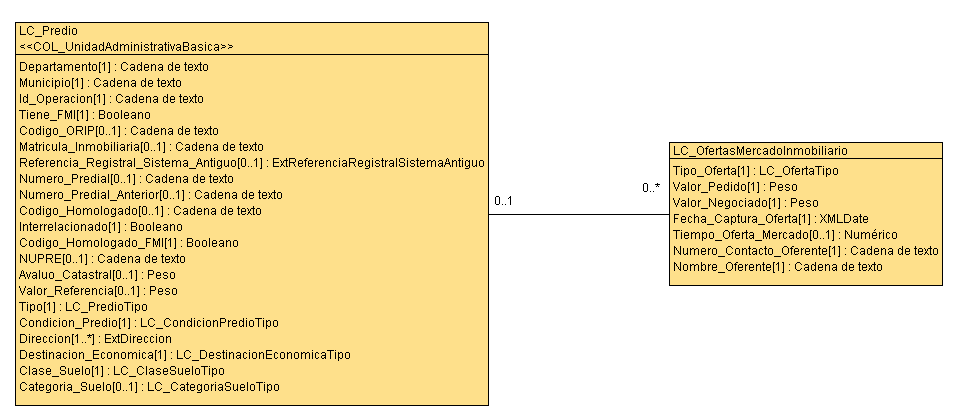
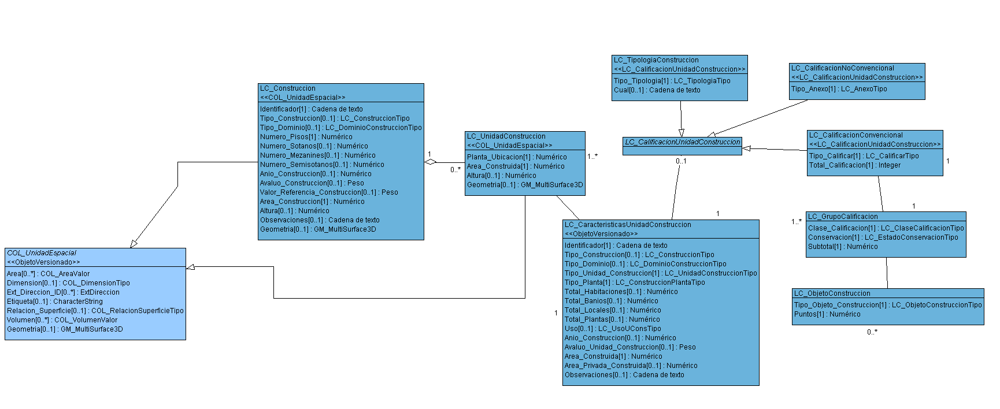

# ¿Cómo eliminar predios en cascada en la base de datos? 

## Objetivo

Enseñar a los estudiantes a eliminar de forma masiva un conjunto de predios registrados en su base de datos de levantamiento catastral 1.2.

## Datos

Para este ejercicio se utilizará  el arxhivo XTF que contiene la información de las UIT de (1,2 y 3): ./datos/LADM_UIT.zip

## Ejercicio

Estructurar la información catastral conforme al modelo LADM-COL de Levantamiento Catastral  1.2 tiene varias ventajas, siendo una de ellas la integridad referencial de la información. Esta integridad referencial conlleva a que diferentes objetos del modelo se relacionen  de forma lógica, trayendo consigo que no se pueda realizar un borrado de la información al asar, sino que se respete la integridad referencial de los objetos. 

En este ejercicio usted aprenderá a eliminar de forma masiva los predios y sus clases asociadas, recorriendo todas las relaciones asociadas a la unidad básica administrativa del catastro. 

### Importación de datos

Haciendo uso del Asistente LADM-COL realizamos la importación del conjunto de datos sugeridos para este ejercicio.


### Seleccionamos los predios a eliminar

Creamos una tabla en la base de datos con los predios a eliminar:

```sql

-- Predios UIT 1
select unnest(ARRAY_AGG(t_id)::int[]) as ids_predio  into predios_a_eliminar 
from ladm.lc_predio 
where id_operacion not in (select id_operacion  from public.predios_uit1 );

-- Predios UIT 2
select unnest(ARRAY_AGG(t_id)::int[]) as ids_predio  into predios_a_eliminar 
from ladm.lc_predio 
where id_operacion not in (select id_operacion  from public.predios_uit2 );

-- Predios UIT 3
select unnest(ARRAY_AGG(t_id)::int[]) as ids_predio  into predios_a_eliminar 
from ladm.lc_predio 
where id_operacion not in (select id_operacion  from public.predios_uit3 );
```


### Paquete administrativo

#### Eliminamos las direcciones asociadas al predio


```sql
--================================================================================
-- Eliminamos las direcciones asociadas al predio
--================================================================================
delete from ladm.extdireccion d
USING ladm.lc_predio as p
WHERE p.t_id = d.lc_predio_direccion and p.t_id = ANY (select ids_predio from predios_a_eliminar);
```


#### Eliminamos los datos de PH Condominio que tenga asociado los predios 

Clase que contiene los datos principales del predio matriz sometido al régimen de propiedad horizontal. Esta clase solamente se debe diligenciar para los predios matrices que estén sometidos al régimen de propiedad horizontal como es el caso del predio matriz de un PH o el predio matriz de un condominio.


```sql
--================================================================================
-- Eliminamos los datos de PH Condominio que tenga asociado los predios 
--================================================================================
delete from ladm.lc_datosphcondominio d
USING ladm.lc_predio as p
WHERE p.t_id = d.lc_predio and p.t_id = ANY (select ids_predio from predios_a_eliminar);
```


#### Eliminamos las ofertas de mercado inmobiliario que tenga asociado los predios

Clase que permite registrar las ofertas de mercado inmobiliarias asociadas a un predio.




```sql
--================================================================================
-- Eliminamos las ofertas de mercado inmobiliario que tenga asociado los predios 
--================================================================================
delete from ladm.lc_ofertasmercadoinmobiliario d
USING ladm.lc_predio as p
WHERE p.t_id = d.lc_predio and p.t_id = ANY (select ids_predio from predios_a_eliminar);
```


#### Eliminamos los datos asociados a la clase de datos adicionales de levantamiento catastral

##### Eliminamos lc_contactovisita

Clase que permite registrar la información del contacto de la visita. Estos datos deben ir asociados a los datos adicionales del levantamiento catastral y se obtienen dentro de los procesos de formación o actualización catastral.


```sql
--================================================================================
-- Eliminamos lc_contactovisita
--================================================================================
delete from ladm.lc_contactovisita cv 
where cv.lc_datos_adicionales = any (
	select 
		unnest(ARRAY_AGG(ld.t_id)::int[])
	from ladm.lc_predio lp
	join ladm.lc_datosadicionaleslevantamientocatastral ld 
	on lp.t_id = ld.lc_predio 
	where lp.t_id = any (select ids_predio from predios_a_eliminar)
);
```


##### Eliminamos relación con lc_estructuranovedadnumeropredial 

```sql
--================================================================================
-- Eliminamos relación con lc_estructuranovedadnumeropredial 
--================================================================================

delete from ladm.lc_estructuranovedadnumeropredial le 
where le.lc_dtsdcnlstmntctstral_novedad_numeros_prediales = any (
	select 
		unnest(ARRAY_AGG(ld.t_id)::int[])
	from ladm.lc_predio lp
	join ladm.lc_datosadicionaleslevantamientocatastral ld 
	on lp.t_id = ld.lc_predio 
	where lp.t_id = any (select ids_predio from predios_a_eliminar)
);
```


##### Eliminamos relación con lc_estructuranovedadfmi 

```sql
--================================================================================
-- Eliminamos relación con lc_estructuranovedadfmi 
--================================================================================

delete from ladm.lc_estructuranovedadfmi le 
where le.lc_dtsdcnlstmntctstral_novedad_fmi = any (
	select 
		unnest(ARRAY_AGG(ld.t_id)::int[])
	from ladm.lc_predio lp
	join ladm.lc_datosadicionaleslevantamientocatastral ld 
	on lp.t_id = ld.lc_predio 
	where lp.t_id = any (select ids_predio from predios_a_eliminar)
);
```


##### Eliminamos los datos de levantamiento catastral 

Clase que permite registrar los datos de adicionales del predio para catastro multipropósito para los procesos de formación o actualización catastral.


```sql
--================================================================================
-- Eliminamos los datos de levantamiento catastral 
--================================================================================
DELETE FROM ladm.lc_datosadicionaleslevantamientocatastral as dlc
USING ladm.lc_predio as p
WHERE p.t_id = dlc.lc_predio and p.t_id = ANY (select ids_predio from predios_a_eliminar);
```


### Paquete unidades espaciales


Seleccionamos las unidades espaciales que vamos a eliminar:

```sql
select d.ue_lc_terreno as ids_terreno into terrenos_a_eliminar
from ladm.col_uebaunit d
join ladm.lc_predio as p on p.t_id = d.baunit 
where  p.t_id = ANY (select ids_predio from predios_a_eliminar) and d.ue_lc_terreno is not null;

select d.ue_lc_construccion ids_construccion into construcciones_a_eliminar
from ladm.col_uebaunit d
join ladm.lc_predio as p on p.t_id = d.baunit 
where  p.t_id = ANY (select ids_predio from predios_a_eliminar) and d.ue_lc_construccion is not null;

select d.ue_lc_unidadconstruccion as ids_uconstruccion into unidades_construccion_a_eliminar
from ladm.col_uebaunit d
join ladm.lc_predio as p on p.t_id = d.baunit 
where  p.t_id = ANY (select ids_predio from predios_a_eliminar) and d.ue_lc_unidadconstruccion is not null;

select d.ue_lc_servidumbretransito ids_servidumbre into servidumbretransito_a_eliminar
from ladm.col_uebaunit d
join ladm.lc_predio as p on p.t_id = d.baunit 
where  p.t_id = ANY (select ids_predio from predios_a_eliminar) and d.ue_lc_servidumbretransito is not null;
```

##### Eliminamos los predios asociados a alguna unidad espacial

```sql
--================================================================================
-- Eliminamos los predios asociados a alguna unidad espacial
--================================================================================

delete from ladm.col_uebaunit d
USING ladm.lc_predio as p
WHERE p.t_id = d.baunit and p.t_id = ANY (select ids_predio from predios_a_eliminar);
```


##### Eliminamos las direcciones asociadas a las unidades espaciales


```sql
--================================================================================
-- Eliminamos las direcciones asociadas a las unidades espaciales
--================================================================================

delete
from ladm.extdireccion e 
where e.lc_terreno_ext_direccion_id = any (
	select ids_terreno from terrenos_a_eliminar
);

delete
from ladm.extdireccion e 
where e.lc_construccion_ext_direccion_id  = any (
	select ids_construccion from construcciones_a_eliminar
);

delete
from ladm.extdireccion e 
where e.lc_unidadconstruccion_ext_direccion_id = any (
	select ids_uconstruccion from unidades_construccion_a_eliminar
);

delete
from ladm.extdireccion e 
where e.lc_servidumbretransito_ext_direccion_id  = any (
	select ids_servidumbre from servidumbretransito_a_eliminar
);
```


##### Eliminamos relaciones en la tablas de topología almacenada col_masccl y col_menosccl

```sql
--=====================================================================================
-- Eliminamos relaciones en la tablas de topología almacenada col_masccl y col_menosccl
--=====================================================================================
select ccl_mas as ids_lindero into lindero_mas
from ladm.col_masccl mc 
where mc.ue_mas_lc_terreno = any (
	select ids_terreno from terrenos_a_eliminar 
);

select ccl_menos as ids_lindero into lindero_menos  
from ladm.col_menosccl mc where mc.ue_menos_lc_terreno = any (
	select ids_terreno from terrenos_a_eliminar 
);

delete from ladm.col_masccl mc 
where mc.ue_mas_lc_terreno = any (
	select ids_terreno from terrenos_a_eliminar 
);

delete from ladm.col_menosccl mc 
where mc.ue_menos_lc_terreno = any (
	select ids_terreno from terrenos_a_eliminar 
);
```
#### -- Eliminamos las fuentes espaciales relacionadas con la tabla lc_terreno por la tabla ccol_uefuente
```sql
--================================================================================
-- Eliminamos las fuentes espaciales relacionadas con la tabla lc_terreno por la tabla ccol_uefuente
--================================================================================

--Seleccionamos las fuentes espaciales a eliminar
select cu.fuente_espacial  as ids_fuente  into fuente_a_eliminar
from  ladm.col_uefuente cu  where cu.ue_lc_terreno = any (
select ids_terreno  from terrenos_a_eliminar tae ); 

--Eliminar las fuentes  que no se relacionen con ningún terreno
delete from ladm.col_uefuente cu 
where cu.ue_lc_terreno = any (
select ids_terreno  from terrenos_a_eliminar tae );

--Eliminar fuentes espaciales
delete  from ladm.lc_fuenteespacial  where t_id  = any (
select  ids_fuente from fuente_a_eliminar) ;
```

#### Eliminamos las unidades espaciales


##### Eliminamos los terrenos


```sql
-- Terrenos
delete 
from ladm.lc_terreno 
where t_id = any(
	select ids_terreno from terrenos_a_eliminar 
);
```


##### Eliminamos las servidumbres de tránsito

```sql
-- Servidumbres transito
delete 
from ladm.lc_servidumbretransito  
where t_id = any(
	select ids_servidumbre from servidumbretransito_a_eliminar  
);
```


##### Eliminamos las construcciones y unidades de construcción





```sql
-- Eliminar construcciones
--Seleccionar  las características de unidad de construcción
select lu.lc_caracteristicasunidadconstruccion   as ids_caracteristicasunidadconstruccion into caracteristicas_a_eliminar
from ladm.lc_unidadconstruccion lu  where t_id = any (
select uc.ids_uconstruccion  from public.unidades_construccion_a_eliminar uc);

-- Calificaciones tipología
delete from ladm.lc_tipologiaconstruccion lt 
where lt.lc_unidad_construccion in (
	select ids_caracteristicasunidadconstruccion  from caracteristicas_a_eliminar
);

-- Calificaciones no convenciones
delete from ladm.lc_calificacionnoconvencional lt 
where lt.lc_unidad_construccion in (
	select ids_caracteristicasunidadconstruccion  from caracteristicas_a_eliminar 
);

-- Convencionales
delete from ladm.lc_objetoconstruccion lo 
where lo.lc_grupo_calificacion in (
	select t_id from ladm.lc_grupocalificacion lg 
	where lg.lc_calificacion_convencional in (
		select t_id from ladm.lc_calificacionconvencional lc where lc.lc_unidad_construccion in (
			select ids_caracteristicasunidadconstruccion  from caracteristicas_a_eliminar
		)
	)
);

delete from ladm.lc_grupocalificacion lg 
where lg.lc_calificacion_convencional in (
	select t_id from ladm.lc_calificacionconvencional lc where lc.lc_unidad_construccion in (
		select ids_caracteristicasunidadconstruccion  from caracteristicas_a_eliminar 
	)
);

delete from ladm.lc_calificacionconvencional lc 
where lc.lc_unidad_construccion in (
	select ids_caracteristicasunidadconstruccion  from caracteristicas_a_eliminar
);


-- Eliminamos las unidades de construccion
delete from ladm.lc_unidadconstruccion lu 
where lu.t_id = any (
	select ids_uconstruccion from unidades_construccion_a_eliminar 
);

--Eliminamos las características de unidad de construcción
delete  from ladm.lc_caracteristicasunidadconstruccion lc where t_id  in (
 select ids_caracteristicasunidadconstruccion  from caracteristicas_a_eliminar 
)
-- Eliminamos las construcciones
delete from ladm.lc_construccion lc 
where t_id = any (
	select ids_construccion from construcciones_a_eliminar 
);

```


### Paquete de topografía y presentación


```sql
delete 
from ladm.col_puntoccl cp 
where cp.ccl = any (
	select *
	from (
		select ids_lindero 
		from lindero_mas union 
		select ids_lindero 
		from lindero_menos
	) as linderos_a_eliminar
	where ids_lindero not in (
		select ccl_mas 
		from ladm.col_masccl union 
		select ccl_menos 
		from ladm.col_menosccl
	)
);

delete
from ladm.lc_lindero l
where l.t_id = any (
	select *
	from (
		select ids_lindero 
		from lindero_mas union 
		select ids_lindero 
		from lindero_menos
	) as linderos_a_eliminar
	where ids_lindero not in (
		select ccl_mas 
		from ladm.col_masccl union 
		select ccl_menos 
		from ladm.col_menosccl
	)
);

delete
from ladm.lc_puntolindero 
where t_id = any (
	select lp.t_id  
	from  ladm.lc_puntolindero lp 
	left join ladm.col_puntoccl cp
	on lp.t_id = cp.punto_lc_puntolindero 
	where cp.t_id is null
);
```


### Paquete de interesados - administrativo y fuentes


##### Creamos la lista de derechos a eliminar

```sql
select 
	t_id,
	interesado_lc_interesado,
	interesado_lc_agrupacioninteresados
into derechos_a_eliminar
from ladm.lc_derecho 
where lc_derecho.unidad = any (
	select ids_predio from predios_a_eliminar
);
```


##### Eliminamos las fuentes administrativas asociadas a los derechos

```sql
delete from ladm.col_rrrfuente 
where col_rrrfuente.rrr_lc_derecho = any (
	select distinct t_id from derechos_a_eliminar
);

delete from ladm.lc_fuenteadministrativa 
where t_id not in (
	select distinct col_rrrfuente.fuente_administrativa from ladm.col_rrrfuente
);

delete from ladm.lc_derecho d
USING ladm.lc_predio as p
WHERE p.t_id = d.unidad and p.t_id = any (select ids_predio from predios_a_eliminar);
```


##### Eliminamos las agrupaciones de interesados


```sql
delete from ladm.col_miembros 
where col_miembros.agrupacion = any (
	select distinct interesado_lc_agrupacioninteresados 
	from derechos_a_eliminar
);

delete from ladm.lc_agrupacioninteresados 
where t_id = any (
	select distinct interesado_lc_agrupacioninteresados from derechos_a_eliminar
);
```

##### Eliminamos los interesados


```sql
delete from ladm.lc_interesadocontacto 
where lc_interesadocontacto.lc_interesado in (
	select t_id
	from ladm.lc_interesado
	where t_id not in (
		select distinct lc_derecho.interesado_lc_interesado as interesado from ladm.lc_derecho where interesado_lc_interesado is not null
		union
		select distinct col_miembros.interesado_lc_interesado as interesado from ladm.col_miembros where interesado_lc_interesado is not null
	)
);

delete from ladm.lc_interesado
where t_id not in (
	select distinct lc_derecho.interesado_lc_interesado as interesado from ladm.lc_derecho where interesado_lc_interesado is not null
	union
	select distinct col_miembros.interesado_lc_interesado as interesado from ladm.col_miembros where interesado_lc_interesado is not null
);
```


### Paquete administrativo


##### Eliminamos los predios matrices


```sql
-- Predios matrices
delete from ladm.lc_predio_copropiedad 
where matriz  in (
	select t_id 
	from ladm.lc_predio 
	where t_id = ANY (select ids_predio from predios_a_eliminar)
);
-- unidades prediales
delete from ladm.lc_predio_copropiedad 
where unidad_predial  in (
	select t_id 
	from ladm.lc_predio 
	where t_id = ANY (select ids_predio from predios_a_eliminar)
);
```

##### Eliminamos los predios

```sql
delete from ladm.lc_predio 
where t_id = ANY (select ids_predio from predios_a_eliminar);
```


##### Borramos tablas temporales

```sql
drop table if exists predios_a_eliminar;
drop table if exists  derechos_a_eliminar; 
drop table if exists terrenos_a_eliminar;
drop table if exists construcciones_a_eliminar;
drop table if exists unidades_construccion_a_eliminar;
drop table if exists servidumbretransito_a_eliminar;
drop table if exists lindero_mas;
drop table if exists lindero_menos;
drop table if exists fuente_a_eliminar;
drop table if exists caracteristicas_a_eliminar;
```


# Resultado por UIT


## UIT 1


## UIT 2


## UIT 3


