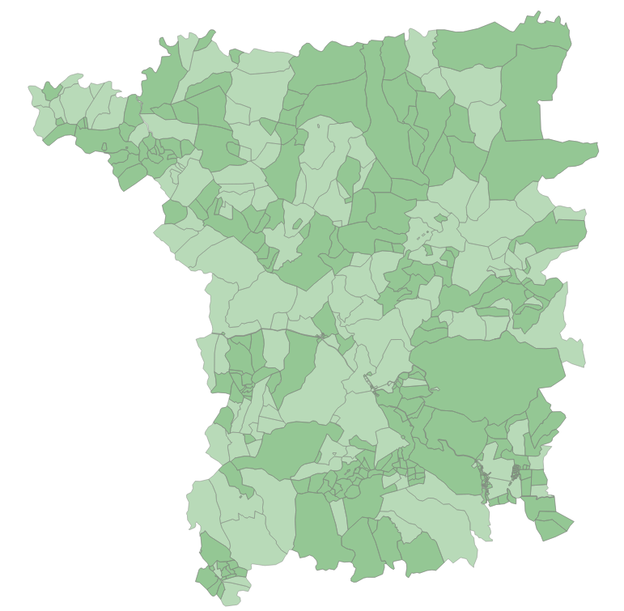
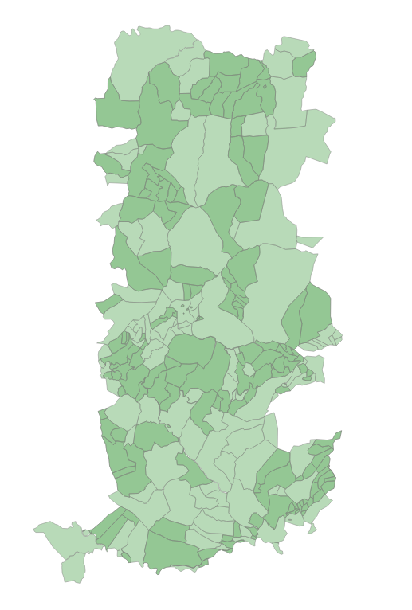
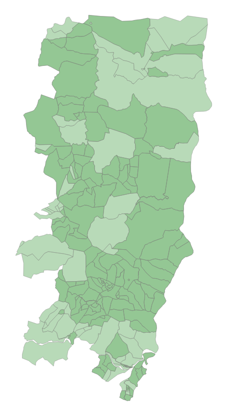
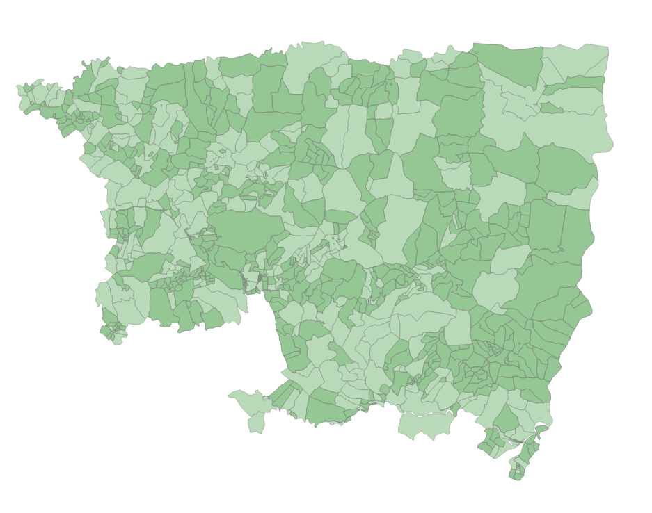
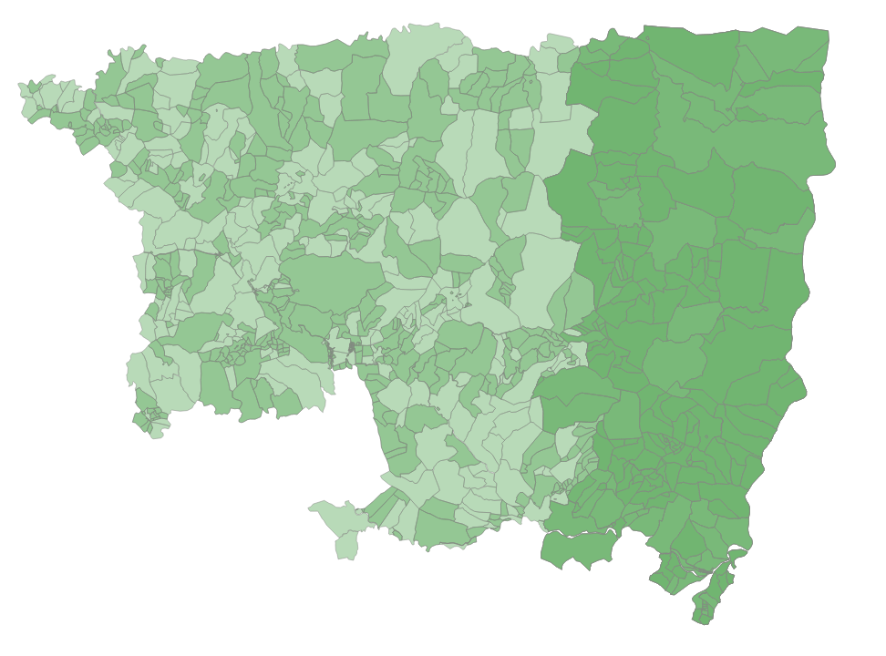

# ¿Cómo importar múltiples archivos XTF en una misma base de datos?

## Objetivo

Brindar al estudiantes recomendaciones para trabajar con archivos XTF

## Datos

XTF con las UIT (Unidad de intervención Territorial):

### XTF UIT 1

### XTF UIT 2

### XTF UIT 3

## Ejercicios

Este ejercicio tiene como propósito enseñar a los estudiantes a importar múltiples XTF en una base de datos.  Para el desarrollo de este ejercicio creamos una base de datos vacía usando el Asistente LADM-COL. Y procedemos a importar los XTF's sobre la misma base de datos con las validaciones actividas:

#### Integración XTFS

Al visualizar la capa de terreno podemos ver la información quedo integrada.

#### Datos importados dos veces o mas

Se debe tener cuidado de importar dos o más veces el mismo XTF, porque tecnicamente es posible importarlo pero al momento de exportar los datos a un XTF no será posible debido a los errores de calidad de los datos, como puede ser el **id_operacion** el cual quedaría duplicado.

