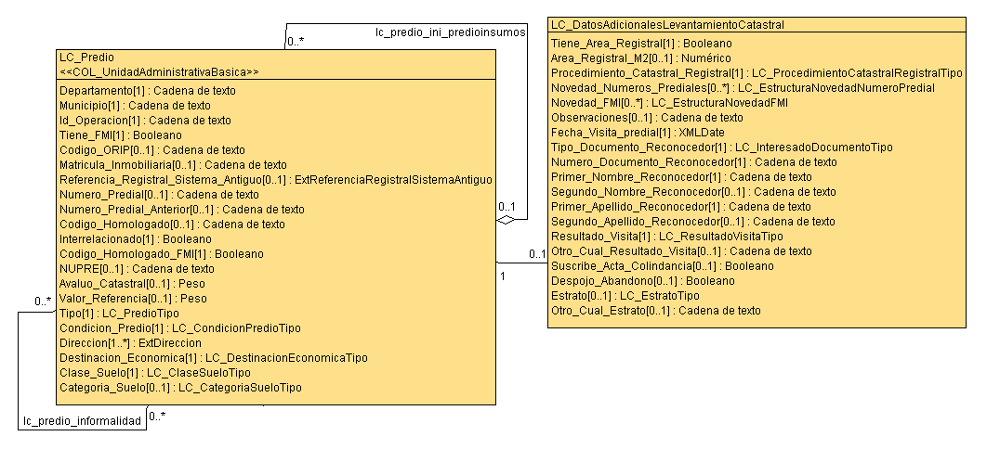
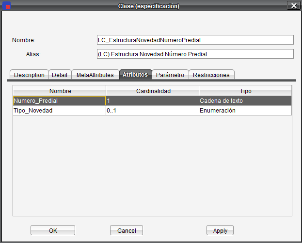
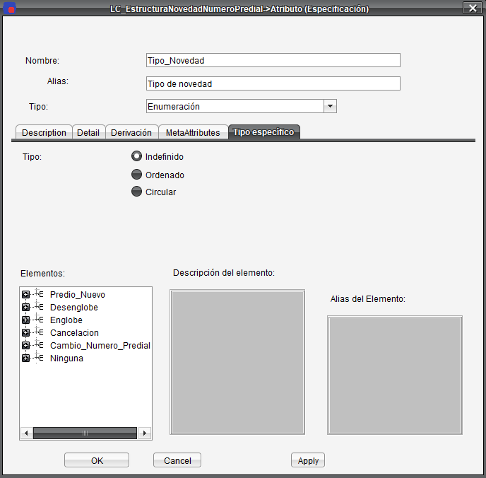
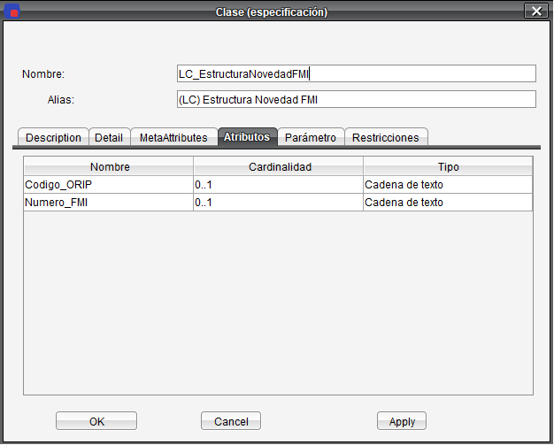

# ¿Cómo comparar los predios registrados en la base de datos con sus novedades de número predial?


## Objetivo

Enseñar al estudiante a comparar los predios registrados en la base de datos de levantamiento catastral con su novedad de número predial.

## Datos

XTF con las UIT (Unidad de intervención Territorial):
	- UIT 1
	- UIT 2
	- UIT 3

datos --> datos/LADM_UIT.zip


## Ejercicio


Este ejercicio tiene como objetivo enseñar al estudiante a consultar que novedades de número predial y folio de matricula inmobiliaria tienen asociado un predio.





### Novedades número predial







```sql
select 
	lp.t_id,
	lp.numero_predial numero_predial_predio,
	le.numero_predial numero_predial_novedad,
	(select ilicode from lc_estructuranovedadnumeropredial_tipo_novedad where t_id = le.tipo_novedad) tipo_novedad
from lc_predio lp
left join lc_datosadicionaleslevantamientocatastral ld on lp.t_id = ld.lc_predio 
left join lc_estructuranovedadnumeropredial le on le.lc_dtsdcnlstmntctstral_novedad_numeros_prediales = ld.t_id
--where le.tipo_novedad = (select t_id from lc_estructuranovedadnumeropredial_tipo_novedad where ilicode like 'Cancelacion')
order by lp.t_id;
```


### Novedad folio de matrícula inmobiliaria




```sql
select 
	lp.t_id,
	lp.numero_predial numero_predial_predio,
	lp.codigo_orip codigo_orip_predio,
	lp.matricula_inmobiliaria matricula_inmobiliaria_predio,
	lf.codigo_orip codigo_orip_novedad,
	lf.numero_fmi numero_fmi_novedad
from lc_predio lp
left join lc_datosadicionaleslevantamientocatastral ld on lp.t_id = ld.lc_predio 
left join lc_estructuranovedadfmi lf on lf.lc_dtsdcnlstmntctstral_novedad_fmi = ld.t_id
-- where lp.matricula_inmobiliaria is null and lf.numero_fmi is null
order by lp.t_id;
```

